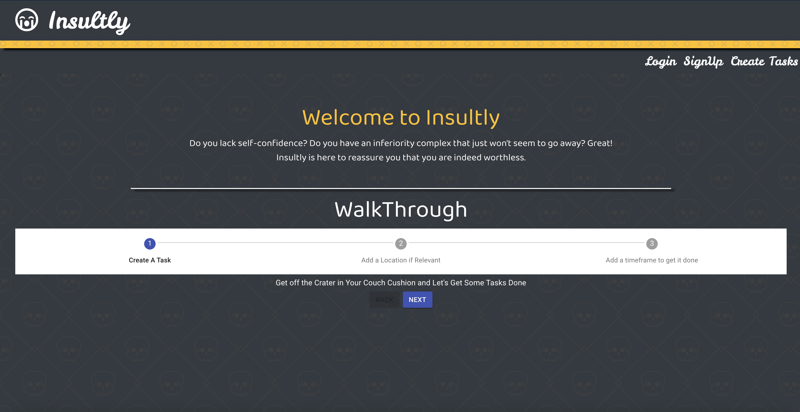
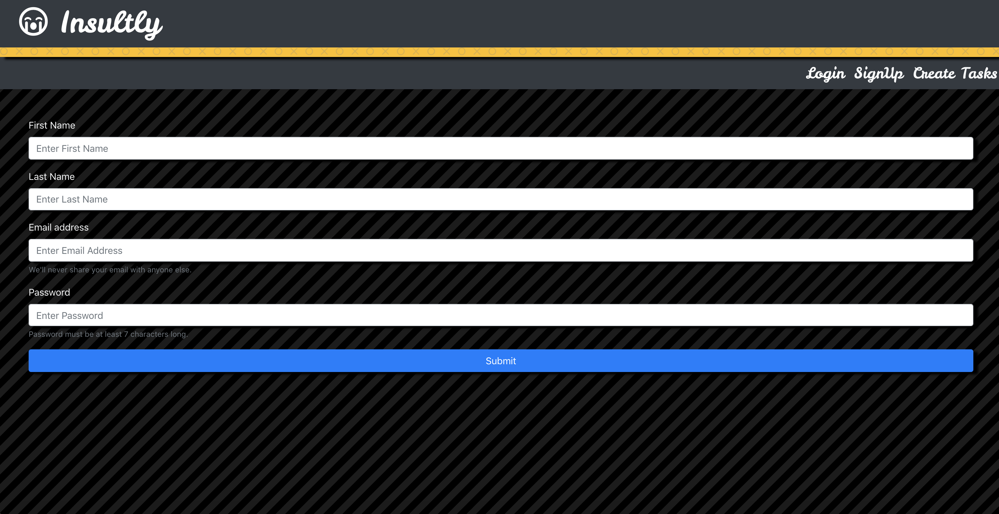

# Insultly 
## Technolgies Used 
```
    ⭐️MERN
    ⭐️Google Maps API
    ⭐️Google Places API
    ⭐️React Geocode 
    ⭐️React-Google-Autocomplete
    ⭐️Bootstrap
    ⭐️Material UI
```
## Welcome Page 



## Profile Page 
###    This is where your Created Tasks are Displayed 
### 📍 React Google Maps API Centers and Places Pin on Location where Task/Errand will take place 
### ⏱ Timer Component Counts Down and Changes State and Displays Insult When Timer Ends


***
## Create Tasks Form
### Input Fields for Task Title, Description, Location, Time to Complete Task

***
## Signup Form

